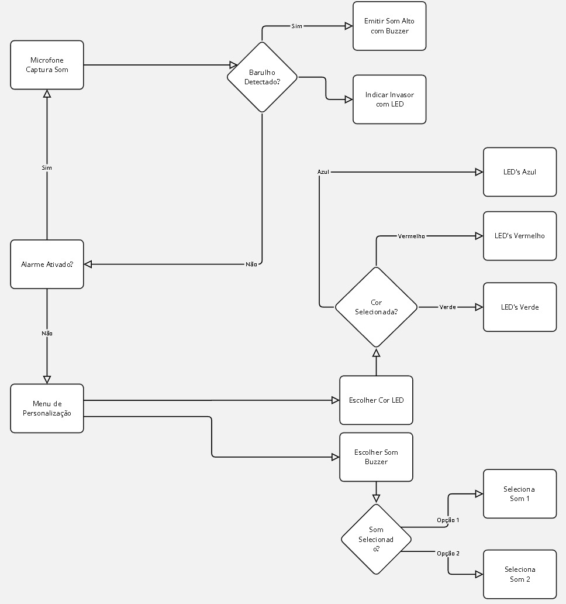

# Sistema de Alarme com RasPberry Pi Pico W

Este projeto implementa um sistema de alarme utilizando um microfone para detecção de som e uma matriz de LEDs para indicação visual. O sistema é controlado por um microcontrolador Raspberry Pi Pico e inclui funcionalidades como menus interativos em um display OLED e configurações de cor e som do alarme.

## Objetivo

O objetivo deste projeto é criar um sistema de alarme residencial simples e eficiente, capaz de detectar sons e alertar os usuários através de luzes e sons.

## Funcionalidades

* **Detecção de Som:** Utiliza um microfone para monitorar o ambiente e detectar sons acima de um limiar configurável.
* **Alarme Visual:** Aciona uma matriz de LEDs com cores personalizáveis para indicar a detecção de som.
* **Alarme Sonoro:** Emite sons através de um buzzer, com opções de tons agudos e graves.
* **Menus Interativos:** Permite configurar as cores e sons do alarme através de menus exibidos em um display OLED.
* **Controle por Joystick:** Navegação nos menus e seleção de opções através de um joystick.
* **Botões de Controle:** Botões para ativar/desativar o alarme e navegar pelos menus.

## Hardware Necessário

* Raspberry Pi Pico
* Matriz de LEDs (WS2812B)
* Microfone
* Buzzer
* Display OLED (SSD1306)
* Joystick
* Botões

## Esquema de Ligação



## Como Utilizar

1.  **Clone o repositório:**
    ```bash
    git clone https://github.com/Vitorhugofsousa/EmbeddedProject.git
    ```
2.  **Conecte os componentes:** Siga o esquema de ligação para conectar os componentes ao Raspberry Pi Pico.
3.  **Compile o código:** Utilize o ambiente de desenvolvimento de sua preferência para compilar o código para o Raspberry Pi Pico.
4.  **Carregue o código:** Carregue o código compilado para o Raspberry Pi Pico.
5.  **Configure o alarme:** Utilize o joystick e os botões para navegar pelos menus e configurar as cores e sons do alarme.
6.  **Ative o alarme:** Pressione o botão para ativar o alarme.
7.  **Teste o alarme:** Produza um som próximo ao microfone para testar o acionamento do alarme.

 #### Verifique o vídeo abaixo listado no YouTube para conferir o projeto
  __[Clique Aqui](https://youtu.be/46o0XIC7aek)__


## Bibliotecas Utilizadas

* pico-sdk
* ssd1306.h
* esp.pio.h

## Contribuições

